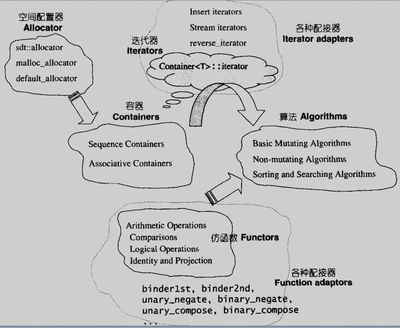
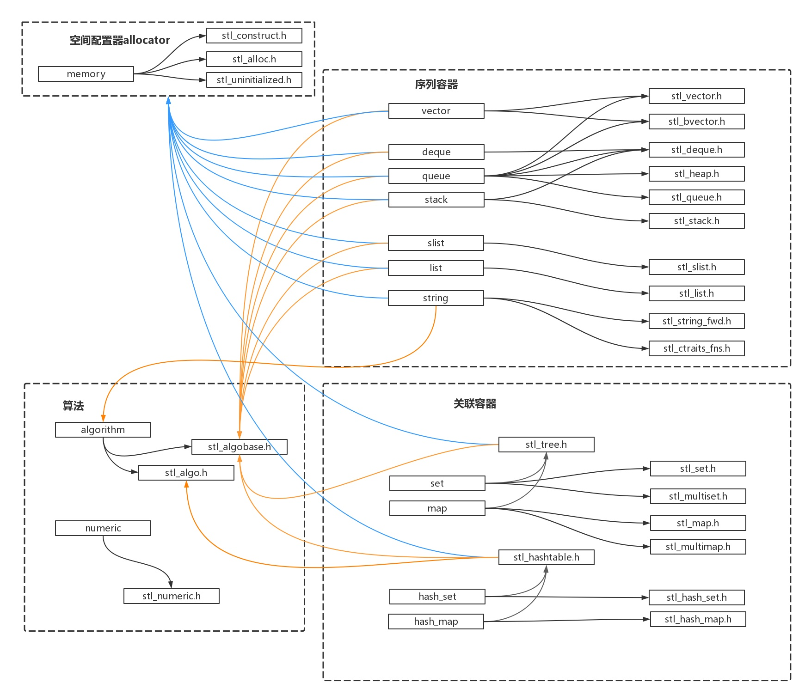

> **源代码：SGI-STL V3.3**

*注：SGI STL并不是原封不动的被用于GCC，所以在GCC中使用STL可能会和SGI STL有一些微小的区别*

## STL六大组件

* 容器 -- **containers**
* 配置器 -- **allocators**
* 算法 -- **algorithms**
* 迭代器 -- **iterators**
* 适配器 -- **adaptors**
* 仿函数 -- **functors**

### STL六大组件关系

### STL部分组件包含关系

## 容器

## GCC 编译器版本

Ubuntu 16.04下gcc version <kbd>5.4.0</kbd>，源码在目录<kbd>/usr/include/c++/5.4.0/bits</kbd>下 stl_xxxx

## 参考资料

* 《STL 源码剖析》 侯捷